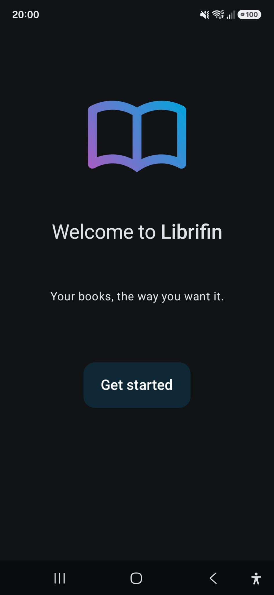
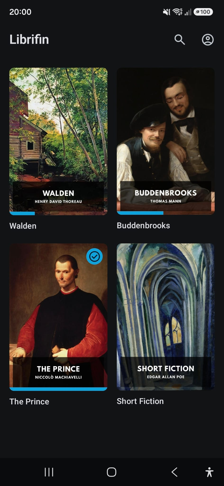
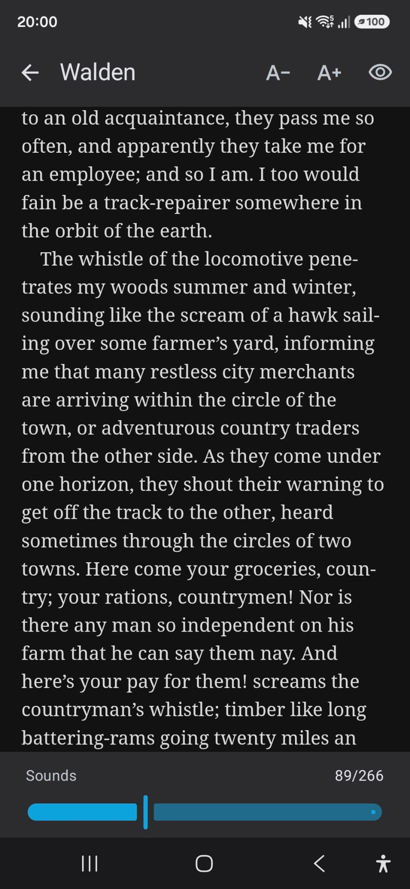

# Librifin

**Librifin** is an EPUB reader for [Jellyfin](https://jellyfin.org). It connects to your own
Jellyfin server, shows your book library and lets you read your books on your phone, online or
offline. It's free, open-source software, just like Jellyfin itself.

Librifin is built with [Kotlin Multiplatform](https://kotlinlang.org/docs/multiplatform.html) and
[Compose Multiplatform](https://www.jetbrains.com/compose-multiplatform/), so most of its code
is shared between Android and iOS.

> [!NOTE]
> Librifin is a very early version. It should work, but some things may not work yet.
> I only develop and test on Android. The iOS app has never been built or tested.

## Why Librifin?

- **Privacy.** No ads, no analytics, no telemetry. The app talks to your
  Jellyfin server and nothing else.
- **Open source.** All of the code is here. Read it, change it, build it yourself.
- **The Jellyfin ecosystem.** Jellyfin is a great server for all of your media but its client apps don't always live up to it. My dream is a great app for every kind of media on Jellyfin. For music, there is [Finamp](https://github.com/finamp-app/finamp), which inspired this app. For books, I couldn't find an app made for Jellyfin, so I built one: Librifin.


## Features

- Finds Jellyfin servers on your local network automatically. You can also enter an address by hand.
- Log in once and stay logged in.
- Your book library as a grid of covers, with each book's reading progress and a mark for finished
  books.
- Search by title or author.
- Tap a book to download and open it. Downloaded books can also be read offline.
- Paginated reading: turn the page by tapping the edges or swiping. Tap the middle of the page to
  show or hide the bars.
- A page slider to move through the whole book, four reading themes (dark, gray, sepia and light),
  adjustable text size, and ten reading fonts to choose from instead of the book's own.
- Your reading position is saved on the device and sent to Jellyfin. A book counts as finished at
  95 % or on its last page, and is then marked as played in Jellyfin.

## Screenshots

| Welcome | Library | Reading | Reading with bars |
|:---:|:---:|:---:|:---:|
|  |  |  |  |

## Requirements

- A Jellyfin server with a library of the content type **Books** that contains EPUB files.
- No plugins needed: Librifin uses Jellyfin's own API directly.
- Your Jellyfin user must be allowed to download media (Dashboard → Users → your user →
  under "Other": "Allow media downloads").
- An Android phone with Android 8.0 or newer.

***You need your own Jellyfin server to use Librifin. If you don't have one yet, see
[Jellyfin's website](https://jellyfin.org) to learn what it is and how to set it up.***

## Getting Librifin

There are no releases yet. For now you can build the app yourself, see below.

## Status and known limitations

Librifin is developed in my free time, so new features and fixes may take a while.

- Android only for now. On iOS the reader, server discovery and saving the login are still
  placeholders, and the iOS app has never been built or tested. Help from anyone with a Mac is welcome.
- One server and one user at a time.
- Progress made in other Jellyfin clients (e.g. Jellyfin's web reader) isn't always picked up yet.

## Contributing

Anyone who wants to help is welcome: bug reports, ideas and pull requests. Please open an
[issue](../../issues) first for larger changes, so we can talk about them before you put in the work.

## Building

You need JDK 17 or newer and the Android SDK (with `ANDROID_HOME` set).

```sh
./gradlew :androidApp:assembleDebug
adb install -r androidApp/build/outputs/apk/debug/androidApp-debug.apk
```

Run the tests with `./gradlew :shared:testAndroidHostTest`.

Nearly all code lives in
[`shared/src/commonMain`](shared/src/commonMain/kotlin), which is shared between Android and iOS. Only
what can't be shared is in `androidMain` and `iosMain` (e.g. server discovery and the book renderer).
[`androidApp`](androidApp) is the Android app around it and [`iosApp`](iosApp) the iOS app.

## Dependencies

Librifin tries to get by with as few libraries as possible. The most important ones:

| Library | What it does in Librifin | License |
|---|---|---|
| [Readium Kotlin Toolkit](https://github.com/readium/kotlin-toolkit) | Opens and renders the EPUB books | BSD-3-Clause |
| [Compose Multiplatform](https://www.jetbrains.com/compose-multiplatform/) with Material 3 | The user interface | Apache-2.0 |
| [Ktor client](https://ktor.io) | Talks to the Jellyfin server (with OkHttp on Android) | Apache-2.0 |
| [kotlinx.serialization](https://github.com/Kotlin/kotlinx.serialization) | Reads and writes Jellyfin's JSON | Apache-2.0 |
| [kotlinx.coroutines](https://github.com/Kotlin/kotlinx.coroutines) | Runs network and file work in the background | Apache-2.0 |
| [Coil](https://coil-kt.github.io/coil/) | Loads and caches the book covers | Apache-2.0 |
| [AndroidX](https://developer.android.com/jetpack/androidx) Lifecycle, Activity, Fragment, Core, WebKit | Android app basics; hosts Readium's reader in Compose and starts its WebView early | Apache-2.0 |
| [desugar_jdk_libs](https://github.com/google/desugar_jdk_libs) | Newer Java APIs on older Android versions, required by Readium | GPL-2.0 with Classpath Exception |

The icons are [Material Symbols](https://fonts.google.com/icons) by Google (Apache-2.0). They're
built into the app, so no icon fonts are downloaded.

The reading fonts are built into the app as well, so choosing one downloads nothing: Literata,
EB Garamond, Lora, Alegreya, Merriweather, Bitter, Source Sans 3, Nunito Sans,
Atkinson Hyperlegible Next and Courier Prime. They're licensed under the SIL Open Font License 1.1;
each font's license is next to its files in
[`shared/src/androidMain/assets/fonts`](shared/src/androidMain/assets/fonts).

## Thanks

- [Jellyfin](https://jellyfin.org) for the server this app is built for.
- [Finamp](https://github.com/jmshrv/finamp), the model for this app, especially for connecting
  to a server.
- [Findroid](https://github.com/jarnedemeulemeester/findroid) and the
  [Jellyfin Kotlin SDK](https://github.com/jellyfin/jellyfin-sdk-kotlin), which helped me understand
  Jellyfin's API.
- [Readium](https://readium.org), which does the hard work of showing the books.

## Disclaimer

Librifin is not an official Jellyfin app, and I'm not affiliated with the Jellyfin project. I simply
wanted to contribute something to the Jellyfin ecosystem.

## License

Librifin is licensed under the [Mozilla Public License 2.0](LICENSE), like Finamp. In short, you
may use, change and share the code, also as part of other projects, including closed-source ones.
If you change Librifin's own files and share the result, those files must stay open under the MPL.
