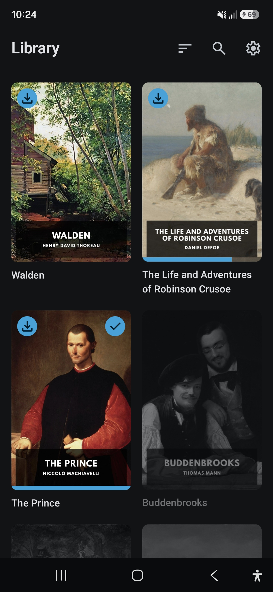
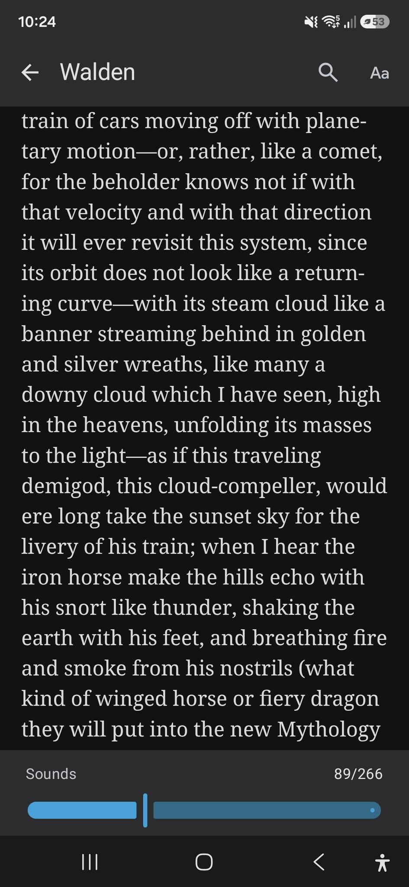

# Librifin

Librifin is an EPUB reader for [Jellyfin](https://jellyfin.org). It connects to your own
Jellyfin server and lets you read your books offline on your phone.

> [!IMPORTANT]
> **Librifin is a personal project, shared as is, with ABSOLUTELY NO WARRANTY.** I built it for myself and it does what I need.
> 
> You're welcome to fork it and turn it into whatever you like.

## Why Librifin exists

I use Jellyfin as the one place for all of my media. For the books in my Jellyfin library, I
couldn't find an app I liked, so I built my own:

- **Made for Jellyfin:** Talks to Jellyfin's own API, so there's no need for the OPDS plugin.
  Your reading progress is saved in Jellyfin too.
- **Free:** No subscription and no paid features.
- **Open source:** All of the code is here under the MPL-2.0.
- **Private:** No ads, no analytics, no crash reporting. The app talks to your Jellyfin server and
  nothing else.

## Features

- Finds Jellyfin servers on your local network automatically, with manual address entry as a
  fallback.
- Log in once and stay logged in.
- Your book library as a grid of covers, most recently read first, with each book's reading
  progress and a mark for finished books.
- Search the library by title or author.
- Tap a book to download and open it. Downloaded books work offline; the others are grayed out
  until the server is back.
- Paginated reading: turn the page by tapping the edges or swiping. Tap the middle of the page to
  show or hide the bars.
- A page slider to move through the whole book.
- Search inside the book you're reading: every match is listed with its chapter and page.
  Navigate between them with arrows.
- Four reading themes (dark, gray, sepia and light).
- Adjustable text size.
- Ten reading fonts to choose from in addition to the book's own.
- Your reading position is saved on the device and your progress is sent to Jellyfin. Once you've
  read 95% of a book or reached its last page, it counts as finished and is marked as played in
  Jellyfin.

## Screenshots

<div align="center">

| Welcome | Library | Search in a book |
|:---:|:---:|:---:|
|  |  |  |
| **Reading** | **Reading with bars** | **Reader appearance** |
|  |  |  |

</div>

## Requirements

- A Jellyfin server with a library of the content type Books that contains EPUB files.
- Your Jellyfin user must be allowed to download media (Dashboard → Users → your user →
  under "Other": "Allow media downloads").
- An Android phone with Android 8.0 or newer.

## Known limitations

Librifin works well for how I use it but it isn't perfect:

- **Android only:** The iOS app has never been built. Most of the code is shared but server
  discovery and the reader exist only for Android. On iOS, the login and settings aren't saved
  between app starts.
- **Single account:** One server and one user at a time.
- **Syncing isn't fully robust:** Progress made in Jellyfin's web reader isn't always picked
  up by Librifin.
- **Synced progress is approximate:** Jellyfin only stores how far you are as a percentage, not
  the exact spot. When you continue on another device, you land near the right page, not exactly
  on it.

## Building

You need JDK 17 or newer and the Android SDK (with `ANDROID_HOME` set).

```sh
./gradlew :androidApp:assembleDebug
adb install -r androidApp/build/outputs/apk/debug/androidApp-debug.apk
```

Run the tests with `./gradlew :shared:testAndroidHostTest`.

Nearly all code lives in
[`shared/src/commonMain`](shared/src/commonMain/kotlin/io/github/mrtnha/librifin), which is shared
between Android and iOS. Only what can't be shared is in
[`androidMain`](shared/src/androidMain/kotlin/io/github/mrtnha/librifin) and
[`iosMain`](shared/src/iosMain/kotlin/io/github/mrtnha/librifin) (e.g. server discovery and the
book renderer). [`androidApp`](androidApp) is the Android app around it and [`iosApp`](iosApp) the
iOS app.

## Dependencies

Librifin tries to get by with as few libraries as possible. The most important ones:

| Library | What it does in Librifin | License |
|---|---|---|
| [Readium Kotlin Toolkit](https://github.com/readium/kotlin-toolkit) | Opens and renders the EPUB books | BSD-3-Clause |
| [Compose Multiplatform](https://www.jetbrains.com/compose-multiplatform/) with Material 3 | Draws the user interface | Apache-2.0 |
| [Ktor client](https://ktor.io) | Talks to the Jellyfin server (with OkHttp on Android) | Apache-2.0 |
| [kotlinx.serialization](https://github.com/Kotlin/kotlinx.serialization) | Reads and writes Jellyfin's JSON | Apache-2.0 |
| [kotlinx.coroutines](https://github.com/Kotlin/kotlinx.coroutines) | Runs network and file work in the background | Apache-2.0 |
| [Coil](https://coil-kt.github.io/coil/) | Loads and caches the book covers | Apache-2.0 |
| [AndroidX](https://developer.android.com/jetpack/androidx) Lifecycle, Activity, Fragment, Core, WebKit | Provides the Android app basics, hosts Readium's reader in Compose and starts its WebView early | Apache-2.0 |
| [AboutLibraries](https://github.com/mikepenz/AboutLibraries) | Collects the licenses of everything bundled into the app for its "Open Source Licenses" screen | Apache-2.0 |
| [desugar_jdk_libs](https://github.com/google/desugar_jdk_libs) | Provides newer Java APIs on older Android versions, as required by Readium | GPL-2.0 with Classpath Exception |

The icons are [Material Symbols](https://fonts.google.com/icons) by Google (Apache-2.0). They're
built into the app, so no icon fonts are downloaded.

The reading fonts are built into the app as well, so choosing one downloads nothing: Literata,
EB Garamond, Lora, Alegreya, Merriweather, Bitter, Source Sans 3, Nunito Sans,
Atkinson Hyperlegible Next and Courier Prime. They're licensed under the SIL Open Font License 1.1;
each font's license is next to its files in
[`shared/src/androidMain/assets/fonts`](shared/src/androidMain/assets/fonts).

## Thanks

- [Jellyfin](https://github.com/jellyfin/jellyfin) for making the server this app is built for.
- [Finamp](https://github.com/finamp-app/finamp) for showing me how to connect to a Jellyfin server.
- [Findroid](https://github.com/jarnedemeulemeester/findroid) and the
  [Jellyfin Kotlin SDK](https://github.com/jellyfin/jellyfin-sdk-kotlin) for helping me understand
  Jellyfin's API.
- [Readium](https://github.com/readium/kotlin-toolkit) for doing the hard work of rendering the books.

## Disclaimer

Librifin is not an official Jellyfin app and I'm not affiliated with the Jellyfin project.

## License

Librifin is licensed under the [Mozilla Public License 2.0](LICENSE).
